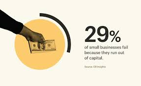

# U.S. Consumer Finance Analysis

<p float="left">    </p>


### Introduction
This project analyzes consumer finance data in the USA to understand patterns in income, expenses, savings, debts, and spending behavior across different demographic groups. The analysis includes data cleaning, feature extraction, and visualization techniques such as histograms, boxplots, scatter plots, and correlation analysis. And this is what I did: cleaned the data, created new financial features (like savings rate and debt-to-income ratio), explored distributions and summary statistics, visualized key trends, and calculated correlations to identify factors influencing financial stability and behavior.

*Import libraries*

```python
import pandas as pd
import matplotlib.pyplot as plt
import plotly.express as px
```

## Conclusion
The analysis of U.S. consumer finance shows how income, spending, savings, and debt vary across demographics. Patterns in financial behavior and correlations between income and savings or debt help identify key factors influencing financial stability. Through data cleaning, visualization, and correlation analysis, the project demonstrates how data science can uncover meaningful insights into consumer finances and guide evidence-based financial decision-making.
